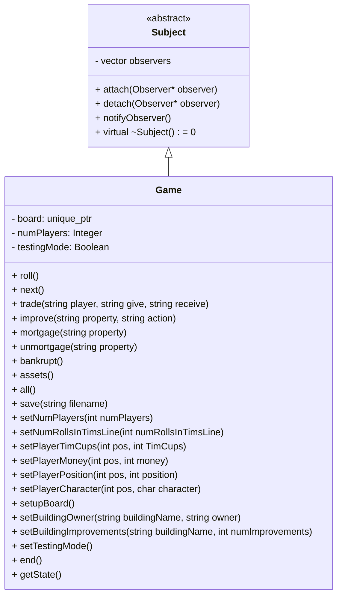

# Watopoly
Watopoly is a video game project for CS246, which is a variant of the classic board game Monopoly. However, instead of the traditional locations, Watopoly's game board is based on the University of Waterloo campus.

---

## Table of Contents

- [1. Overview](#1-overview)
  - [1.1 Introduction to Watopoly](#11-introduction-to-watopoly)
  - [1.2 Game Objectives](#12-game-objectives)
  - [1.3 Core Mechanics](#13-core-mechanics)
    - [1.3.1 Board and Movement](#131-board-and-movement)
    - [1.3.2 Properties and Ownership](#132-properties-and-ownership)
    - [1.3.3 Financial Transactions](#133-financial-transcations)
    - [1.3.4 Special Squares](#134-special-squares)
    - [1.3.5 Player Interactions](#135-player-interactions)
    - [1.3.6 Game Progression](#136-game-progression)
    - [1.3.7 Additional Mechanics](#137-additional-mechanics)
- [2. Design](#2-design)
  - [2.1 Class Diagram](#21-class-diagrams)
  - [2.2 Design Patterns Utilized](#22-design-patterns-utilized)
  - [2.3 Data Structures](#23-data-structures)
- [3. Board Layout](#3-board-layout)
- [4. Game Logic](#4-game-logic)
- [5. Command Interpreter](#5-command-interpreter)
- [6. Player Management](#6-player-management)
- [7. Auctions](#7-auctions)
- [8. Saving and Loading](#8-saving-and-loading)
- [9. User Interface (UI)](#9-user-interface-(ui))
- [10. Team Members](#10-team-members)
- [11. Appendix](#11-appendix)
  - [11.1 Code Snippets](#111-code-snippets)


---

## 1. Overview

### 1.1 Introduction to Watopoly
In Watopoly, players take turns moving around the board, buying and improving on-campus buildings (which function as properties), and paying tuition (rent) to other players. The game features 40 squares, representing various locations on the University of Waterloo campus. The goal of the game is to be the last player remaining who has not gone bankrupt.

### 1.2 Game Objectives
The objective of the game Watopoly is to be the last player remaining who has not dropped out of university (declared bankruptcy). Players take turns moving around a 40-square board, buying and improving on-campus buildings (properties), and paying tuition (rent) to other players. The game continues until only one player remains solvent, and that player is declared the winner.

### 1.3 Core Mechanics
#### 1.3.1 Board and Movement
• The game is played on a 40-square board representing the University of Waterloo campus.

• Players roll two dice to move around the board.

• Landing on different squares triggers specific actions.

#### 1.3.2 Properties and Ownership
• Players can purchase unowned properties (academic buildings, gyms, and residences) they land on.

• Academic buildings are grouped into monopolies.

• Owning all properties in a monopoly allows for improvements (bathrooms and cafeterias).

#### 1.3.3 Financial Transactions
• Players pay tuition (rent) when landing on owned properties.

• Collect OSAP (similar to "Passing Go") awards $200 to players.

• Players can mortgage properties to raise funds.

#### 1.3.4 Special Squares
• DC Tims Line (similar to "Jail").

• SLC and Needles Hall squares trigger random events.

• Goose Nesting, Tuition, and Coop Fee squares have specific effects.

#### 1.3.5 Player Interactions
• Players can trade properties and money with each other.

• Auctions occur when players choose not to buy properties or go bankrupt.

#### 1.3.6 Game Progression
• Players take turns moving, buying properties, and paying fees.

• The game continues until all but one player have declared bankruptcy.

#### 1.3.7 Additional Mechanics
• Improvements increase property value and rent.

• Roll Up the Rim cups can be collected to get out of DC Tims Line.

• Players can mortgage and unmortgage properties.

• Bankruptcy occurs when a player owes more than they can pay.

---
## 2. Design

### 2.1 Class Diagram



### 2.2 Design Patterns Utilized

### 2.3 Data Structures

---

## 3. Board Layout

```cpp
____________________________________________________________________________________________________
|Goose   |        |NEEDLES |        |        |V1      |        |        |CIF     |        |GO TO   |
|Nesting |--------|HALL    |--------|--------|        |--------|--------|        |--------|TIMS    |
|        |EV1     |        |EV2     |EV3     |        |PHYS    |B1      |        |B2      |        |
|        |        |        |        |        |        |        |        |        |        |        |
|________|________|________|________|________|________|________|________|________|________|________|
|        |                                                                                |        |
|--------|                                                                                |--------|
|OPT     |                                                                                |EIT     |
|        |                                                                                |        |
|________|                                                                                |________|
|        |                                                                                |        |
|--------|                                                                                |--------|
|BMH     |                                                                                |ESC     |
|        |                                                                                |        |
|________|                                                                                |________|
|SLC     |                                                                                |SLC     |
|        |                                                                                |        |
|        |                                                                                |        |
|        |                                                                                |        |
|________|                                                                                |________|
|        |                                                                                |        |
|--------|                                                                                |--------|
|LHI     |                                                                                |C2      |
|        |                 ______________________________________________                 |        |
|________|                |                                              |                |________|
|UWP     |                | #   # #### ##### ##### #### ##### #    #   # |                |REV     |
|        |                | #   # #  #   #   #   # #  # #   # #    #   # |                |        |
|        |                | # # # ####   #   #   # #### #   # #    ##### |                |        |
|        |                | # # # #  #   #   #   # #    #   # #      #   |                |        |
|________|                | ##### #  #   #   ##### #    ##### ####   #   |                |________|
|        |                |______________________________________________|                |NEEDLES |
|--------|                                                                                |HALL    |
|CPH     |                                                                                |        |
|        |                                                                                |        |
|________|                                                                                |________|
|        |                                                                                |        |
|--------|                                                                                |--------|
|DWE     |                                                                                |MC      |
|        |                                                                                |        |
|________|                                                                                |________|
|PAC     |                                                                                |COOP    |
|        |                                                                                |FEE     |
|        |                                                                                |        |
|        |                                                                                |        |
|________|                                                                                |________|
|        |                                                                                |        |
|--------|                                                                                |--------|
|RCH     |                                                                                |DC      |
|        |                                                                                |        |
|________|________________________________________________________________________________|________|
|DC Tims |        |        |NEEDLES |        |MKV     |TUITION |        |SLC     |        |COLLECT |
|Line    |--------|--------|HALL    |--------|        |        |--------|        |--------|OSAP    |
|        |HH      |PAS     |        |ECH     |        |        |ML      |        |AL      |        |
|        |        |        |        |        |        |        |        |        |        |        |
|________|________|________|________|________|________|________|________|________|________|________|
```

---
## 4. Game Logic

---
## 5. Command Interpreter

---
## 6. Player Management

---
## 7. Auctions

---
## 8. Saving and Loading

---
## 9. User Interface (UI)

---
## 10. Team Members
1. Yashila Barnwal
2. Lakshit Luhadia
3. Dhruv Kumar

---
## 11. Appendix

### 11.1 Code Snippets
