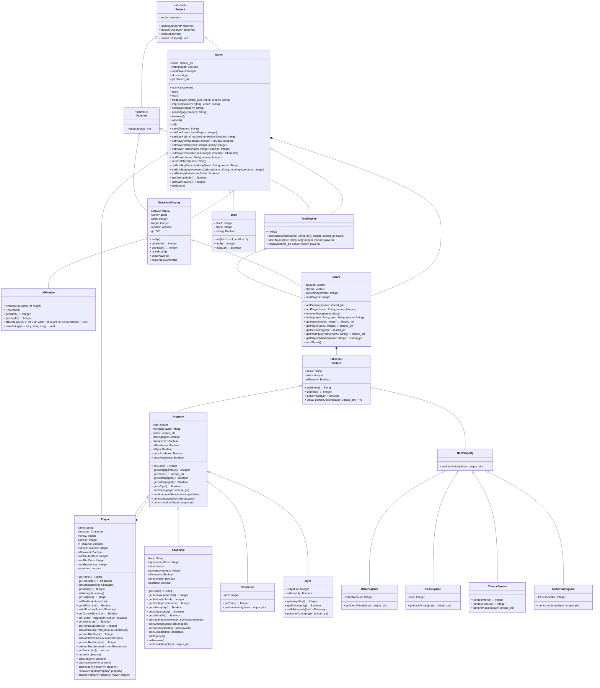
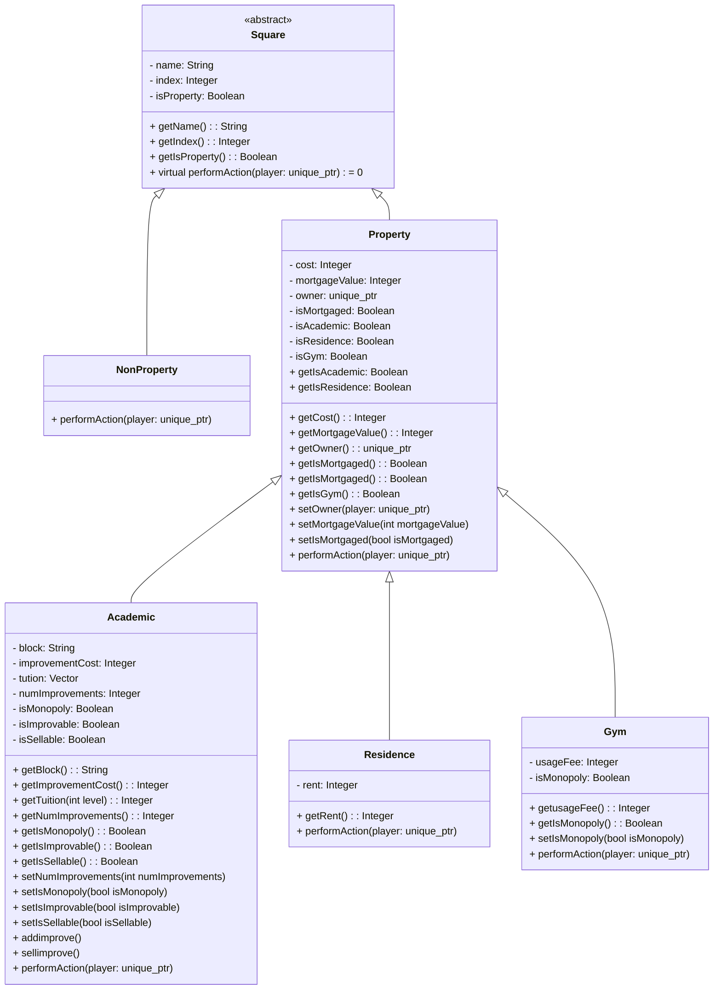

# Watopoly
Watopoly is a video game project for CS246, which is a variant of the classic board game Monopoly. However, instead of the traditional locations, Watopoly's game board is based on the University of Waterloo campus.

---

## Table of Contents

- [1. Overview](#1-overview)
  - [1.1 Introduction to Watopoly](#11-introduction-to-watopoly)
  - [1.2 Game Objectives](#12-game-objectives)
  - [1.3 Core Mechanics](#13-core-mechanics)
    - [1.3.1 Board and Movement](#131-board-and-movement)
    - [1.3.2 Properties and Ownership](#132-properties-and-ownership)
    - [1.3.3 Financial Transactions](#133-financial-transactions)
    - [1.3.4 Special Squares](#134-special-squares)
    - [1.3.5 Player Interactions](#135-player-interactions)
    - [1.3.6 Game Progression](#136-game-progression)
    - [1.3.7 Additional Mechanics](#137-additional-mechanics)
- [2. Design](#2-design)
  - [2.1 Class Diagram](#21-class-diagram)
  - [2.2 Design Patterns Utilized](#22-design-patterns-utilized)
- [3. Board Layout](#3-board-layout)
- [4. Game Logic](#4-game-logic)
- [5. Command Interpreter](#5-command-interpreter)
- [6. Player Management](#6-player-management)
- [7. Auctions](#7-auctions)
- [8. Saving and Loading](#8-saving-and-loading)
   - [8.1 Saving the Game](#81-saving-the-game)
   - [8.2 Loading the Game](#82-loading-the-game)
- [9. User Interface](#9-user-interface)
- [10. Team Members](#10-team-members)


---

## 1. Overview

### 1.1 Introduction to Watopoly
In Watopoly, players take turns moving around the board, buying and improving on-campus buildings (which function as properties), and paying tuition (rent) to other players. The game features 40 squares, representing various locations on the University of Waterloo campus. The goal of the game is to be the last player remaining who has not gone bankrupt.

### 1.2 Game Objectives
The objective of the game Watopoly is to be the last player remaining who has not dropped out of university (declared bankruptcy). Players take turns moving around a 40-square board, buying and improving on-campus buildings (properties), and paying tuition (rent) to other players. The game continues until only one player remains solvent, and that player is declared the winner.

### 1.3 Core Mechanics
#### 1.3.1 Board and Movement
• The game is played on a 40-square board representing the University of Waterloo campus.

• Players roll two dice to move around the board.

• Landing on different squares triggers specific actions.

#### 1.3.2 Properties and Ownership
• Players can purchase unowned properties (academic buildings, gyms, and residences) they land on.

• Academic buildings are grouped into monopolies.

• Owning all properties in a monopoly allows for improvements (bathrooms and cafeterias).

#### 1.3.3 Financial Transactions
• Players pay tuition (rent) when landing on owned properties.

• Collect OSAP (similar to "Passing Go") awards $200 to players.

• Players can mortgage properties to raise funds.

#### 1.3.4 Special Squares
• DC Tims Line (similar to "Jail").

• SLC and Needles Hall squares trigger random events.

• Goose Nesting, Tuition, and Coop Fee squares have specific effects.

#### 1.3.5 Player Interactions
• Players can trade properties and money with each other.

• Auctions occur when players choose not to buy properties or go bankrupt.

#### 1.3.6 Game Progression
• Players take turns moving, buying properties, and paying fees.

• The game continues until all but one player have declared bankruptcy.

#### 1.3.7 Additional Mechanics
• Improvements increase property value and rent.

• Roll Up the Rim cups can be collected to get out of DC Tims Line.

• Players can mortgage and unmortgage properties.

• Bankruptcy occurs when a player owes more than they can pay.

---
## 2. Design

### 2.1 Class Diagram



### 2.2 Design Patterns Utilized
#### Template Method Design Pattern
The Template Method Design Pattern is used in the codebase to define the skeleton of an algorithm in a base class while allowing subclasses to override specific steps of the algorithm without changing its structure. This pattern is particularly useful when you have a common algorithm that can be customized by subclasses.

1. Base Class: The ```Square``` class serves as the base class for all squares on the game board. It defines a virtual method ```performAction```, which is the template method. This method outlines the general structure of what should happen when a player lands on a square.
   
2. Subclasses: Various subclasses of ```Square```, such as ```Property```, ```Academic```, ```Residence```, ```Gym```, and ```NonProperty```, inherit from ```Square``` and override the ```performAction``` method. Each subclass provides its own implementation of what should happen when a player lands on that specific type of square.
 
3. Algorithm Structure: The ```performAction``` method in the base class ```Square``` is a placeholder that subclasses must implement. This ensures that all squares have a consistent interface for performing actions, but the specific behavior can vary based on the type of square.
   


#### Command Design Pattern
The Command Pattern is a behavioral design pattern that encapsulates a request as an object, thereby allowing for parameterization of clients with queues, requests, and operations. It also provides support for undoable operations.

1. Encapsulation of Actions: The various actions that a player can perform in the game (like rolling dice, trading properties, mortgaging, improving properties, etc.) are encapsulated as methods within the ```Game``` class. Each of these methods represents a command that can be executed.

2. Method Calls as Commands: The Game class contains methods that correspond to specific commands:
   1. ```roll``` method:
   2. ```trade``` method:
   3. ```improve``` method:
   4. ```mortgage``` method:
   5. ```unmortgage``` method:
   6. ```bankrupt``` method:
```cpp
void Game::bankrupt() {
    // Declare bankruptcy
    std::shared_ptr<Player> currentPlayer = board->getCurrentPlayer();

    bool bankrupt = currentPlayer->getIsBankrupt();

    if (bankrupt) {
        int numplayers = getNumPlayers();
        if (numplayers == 2) {
            std::cout << "Game Over! " << currentPlayer->getName() << " is bankrupt!" << std::endl;
            removePlayer(currentPlayer->getName());
        } else {
            int index = currentPlayer->getPosition();
            std::shared_ptr<Square> square = board->getSquare(index);
            if (std::shared_ptr<Property> property = std::dynamic_pointer_cast<Property>(square)) {
                std::shared_ptr<Player> owner = property->getOwner();
                if (owner != currentPlayer) {
                    std::vector<std::shared_ptr<Property>> properties = currentPlayer->getProperties();
                    for (auto& property : properties) {
                        property->setOwner(owner);
                        owner->addProperty(property);
                        if (std::shared_ptr<Academic> academicBuilding = std::dynamic_pointer_cast<Academic>(property)) {
                            while (academicBuilding->getNumImprovements() > 0) {
                                academicBuilding->sellimprove();
                            }
                        }
                        currentPlayer->removeProperty(properties.back());
                        properties.pop_back();
                    }
                    int numCups = currentPlayer->getNumRimCups();
                    int ownerRimCups = owner->getNumRimCups();
                    owner->setNumRimCups(numCups + ownerRimCups);
                }
            } else {                
                std::vector<std::shared_ptr<Property>> properties = currentPlayer->getProperties();
                for (auto& property : properties) {
                    std::string propertyName = property->getName();
                    unmortgage(propertyName);
                    property->setOwner(nullptr);
                    auction(property);
                }
            }
            
            removePlayer(currentPlayer->getName());
            std::cout << currentPlayer->getName() << " is bankrupt!" << std::endl;
            std::cout << "You have been removed from the game." << std::endl;
            next();
        }
    } else {
        std::cout << "You are not bankrupt. You can not declare bankruptcy." << std::endl;
    }
}      
```
   7. ```assets``` method:
```cpp
void Game::assets() {
    // Display assets
    // This function will use getProperties function from Player class
    std::vector<std::shared_ptr<Property>> properties = board->getCurrentPlayer()->getProperties();
    std::cout << "You have the following properties: " << std::endl;
    for (auto property : properties) {
        std::cout << property->getName() << std::endl;
    }
    std::cout << "You have $" << board->getCurrentPlayer()->getMoney() << "." << std::endl;
    std::cout << "You have " << board->getCurrentPlayer()->getNumRimCups() << " Tim Cups." << std::endl;
    //notifyObservers();
}
```
   8. ```all``` method:
```cpp
void Game::all() {
    // Display asssets of all players
    for (int i = 0; i < numPlayers; i++) {
        std::cout << board->getPlayer(i)->getName() << " has: " << std::endl;
        std::vector<std::shared_ptr<Property>> properties = board->getPlayer(i)->getProperties();
        std::cout << "Properties: ";
        for (auto property : properties) {
            std::cout << property->getName() << " ";
        }
        std::cout << std::endl;
        std::cout << "Money: " << board->getPlayer(i)->getMoney() << std::endl;
        std::cout << "Tim Cups: " << board->getPlayer(i)->getNumRimCups() << std::endl;
    }
    //notifyObservers();
}
```
   9. ```save``` method:
```cpp
void Game::save(std::string filename) {
    // Save the game
    std::ofstream savefile{filename};
    if (savefile.fail()) {
        std::cerr << "Cannot open the save file" << std::endl;
    } else {
        // Save the game state
        // Save the number of players first
        savefile << numPlayers << std::endl;
        for (int i = 0; i < numPlayers; i++) {
            std::shared_ptr<Player> p = board->getPlayer(i);
            // This is following the format: name character numRimCups money position
            savefile << p->getName() << " " << p->getCharacter() << " " << p->getNumRimCups() << " " 
                     << p->getMoney() << " " << p->getPosition() << " ";
            if (p->getPosition() == 10) {
                if (p->getInTimsLine()) { // Check if the player is in Tims Line
                    savefile << 1 << " " << p->getTurnsInTimsLine();
                } else {
                    savefile << 0;
                }
            }
            savefile << std::endl;
        }
        for (int i = 0; i < 40; i++) {
            int mortgageImprovements = -1;
            // This is following the format: name owner numImprovements
            if (board->getSquare(i)->getIsProperty() == false) {
                // Do not save the non-property square
                continue;
            } else {
                std::shared_ptr<Property> property = std::dynamic_pointer_cast<Property>(board->getSquare(i));
                if (property) {
                    savefile << property->getName() << " ";
                    if (property->getOwner() == nullptr) {
                        savefile << "BANK" << " ";
                    } else {
                        savefile << property->getOwner()->getName() << " ";
                    }

                    if (property->getIsMortgaged()) {
                        savefile << mortgageImprovements << std::endl; // -1 for mortgaged
                    } else if (property->getIsResidence() || property->getIsGym()) {
                        savefile << 0 << std::endl; // No improvements for Residence and Gym
                    } else {
                        std::shared_ptr<Academic> academicBuilding = std::dynamic_pointer_cast<Academic>(property); // Downcast to Academic
                        if (!academicBuilding->getIsMonopoly()) {
                            savefile << 0 << std::endl; // No improvements for non-monopoly
                        } else {
                            // Save the number of improvements for Academic buildings
                            savefile << academicBuilding->getNumImprovements() << std::endl;
                        }
                    }
                }
            }
        }
    }
}
```

Each of these methods can be thought of as a command that modifies the state of the game.

3. Processing Commands: In the ```processInGameCommands``` function, user input is read and matched to specific commands. Based on the command entered by the user, the corresponding method in the ```Game``` class is called. This effectively decouples the command execution from the user interface, allowing for a clean separation of concerns.
```cpp
void processInGameCommands(Game& g) {
    auto b = g.getBoard(); // Get the board from the game
    bool hasRolled = false;
    bool hasTakenActionInTimsLine = false;

    while (true) {
        auto currentPlayer = b->getCurrentPlayer();
        std::cout << currentPlayer->getName() << "'s turn." << std::endl;

        // NEW: Handle first turn in Tims Line
        if (currentPlayer->getInTimsLine() && currentPlayer->getTurnsInTimsLine() == 0) {
            hasTakenActionInTimsLine = true; // Block prompt this turn
        }

        // Check if player is in Tims Line and needs to act
        if (currentPlayer->getInTimsLine() 
            && !hasTakenActionInTimsLine 
            && currentPlayer->getTurnsInTimsLine() > 0) {
            std::cout << "You are in Tims Line. Do you want to use a Tim Cup, Roll for doubles, or Pay $50? (tim/roll/pay): ";
            std::string timsCommand;
            std::cin >> timsCommand;

            if (timsCommand == "pay") {
                int cost = 50; // Cost to get out of Tims Line
                if (currentPlayer->getMoney() >= cost) {
                    currentPlayer->subtractMoney(cost);
                    currentPlayer->setInTimsLine(false);
                    currentPlayer->setTurnsInTimsLine(0);
                    std::cout << "You paid $50 to get out of Tims Line." << std::endl;
                    hasTakenActionInTimsLine = true; // Mark action as taken
                } else {
                    std::cout << "Insufficient funds to pay $50!" << std::endl;
                }
            } else if (timsCommand == "tim") {
                if (currentPlayer->getNumRimCups() > 0) {
                    currentPlayer->setInTimsLine(false);
                    currentPlayer->setTurnsInTimsLine(0);
                    currentPlayer->setNumRimCups(currentPlayer->getNumRimCups() - 1);
                    std::cout << "Used Tim Cup to exit Tims Line." << std::endl;
                    hasTakenActionInTimsLine = true; // Mark action as taken
                } else {
                    std::cout << "No Tim Cups available!" << std::endl;
                }
            } else if (timsCommand == "roll") {
                if (hasRolled) {
                    std::cerr << "Invalid Command. You have already rolled this turn." << std::endl;
                } else {
                    g.roll();
                    hasRolled = true;
                    hasTakenActionInTimsLine = true; // Mark action as taken
                }
            } else {
                std::cerr << "Invalid command. Please enter 'tim', 'roll', or 'pay'." << std::endl;
            }

            continue; // Skip other commands after taking action in Tims Line
        }

        // Handle other commands outside of Tims Line actions
        std::string command;
        std::cin >> command;

        if (command == "roll") {
            if (hasRolled) {
                std::cerr << "Invalid Command. You have already rolled this turn." << std::endl;
                continue;
            }

            if (g.getTestingMode()) {
                std::string input;
                std::getline(std::cin, input); // Read the entire line after "roll"

                // Check if input contains two integers
                std::istringstream iss(input);
                int die1, die2;

                if (iss >> die1 >> die2) {
                    if (die1 < 0 || die2 < 0) {
                        std::cerr << "Invalid dice roll. Please enter non-negative numbers." << std::endl;
                        continue;
                    }
                    g.roll(die1, die2); // Call roll with specified dice
                } else {
                    g.roll(-1, -1); // Call usual roll function
                }
            } else {
                g.roll(-1, -1); // Call usual roll function in non-testing mode
            }

            hasRolled = true; // Mark as rolled for this turn
        
        } else if (command == "next") {
            g.next();
            hasRolled = false;
            hasTakenActionInTimsLine = false; // Reset Tims Line action flag for next turn
        } else if (command == "trade") {
            std::string player, give, receive;
            std::cin >> player >> give >> receive;

            bool giveIsInt = std::all_of(give.begin(), give.end(), ::isdigit);
            bool receiveIsInt = std::all_of(receive.begin(), receive.end(), ::isdigit);

            if (!giveIsInt || !receiveIsInt) { 
                g.trade(player, give, receive);
            } else {
                std::cout << "reject" << std::endl;
            }
        
        } else if (command == "improve") {
            std::string property, action;
            std::cin >> property >> action;

            g.improve(property, action);

        } else if (command == "mortgage") {
            std::string property;
            std::cin >> property;
            g.mortgage(property);

        } else if (command == "unmortgage") {
            std::string property;
            std::cin >> property;
            g.unmortgage(property);

        } else if (command == "bankrupt") {
            g.bankrupt();

        } else if (command == "assets") {
            g.assets();

        } else if (command == "all") {
            g.all();

        } else if (command == "save") {
            std::string filename;
            std::cin >> filename;
            g.save(filename);
            
        } else {
            std::cerr << "Invalid command. Please enter a valid command." << std::endl;
        }

        // Check for game end condition
        if (g.getNumPlayers() == 1) {
            auto winner = b->getCurrentPlayer();
            std::cout << winner->getName() << " wins the game!" << std::endl;
            break;
        }
    }
}
```

#### Singleton Design Pattern
The Singleton Design Pattern ensures that a class has only one instance and provides a global point of access to that instance.

1. Private Constructor: The constructor of the ```Dice``` class is private, which prevents external instantiation of the class. This is a key characteristic of the Singleton pattern.
   
```cpp
class Dice {
    static int dice1; // Dice 1's roll (ranges from 1 - 6)
    static int dice2; // Dice 2's roll (ranges from 1 - 6)
    static bool testing; // Whether in testing mode or not

    // Rest of the Implementation
}
```

2. Static Methods: The ```Dice``` class provides static methods to access and manipulate the dice values. This allows the class to maintain its state without needing to instantiate it multiple times.

 ```cpp
class Dice {
  // ...

  public:

    // Rolls the dice (sets dice1 and dice2 to numbers from 1 - 6)
       static void roll(int d1 = -1, int d2 = -1);

    // Adds dice1 and dice2 values (ranges 1 - 12)
       static int add();

    // Returns true if dice1 and dice2 are equal else false
       static bool isEqual();

    // Rest of the Implementation

}
```

In the game logic, the ```Dice``` class is used to roll the dice and determine the outcome of player actions. The static methods allow the game to access the dice functionality without needing to create an instance of the ```Dice``` class.

---

## 3. Board Layout

```cpp
____________________________________________________________________________________________________
|Goose   |        |NEEDLES |        |        |V1      |        |        |CIF     |        |GO TO   |
|Nesting |--------|HALL    |--------|--------|        |--------|--------|        |--------|TIMS    |
|        |EV1     |        |EV2     |EV3     |        |PHYS    |B1      |        |B2      |        |
|        |        |        |        |        |        |        |        |        |        |        |
|________|________|________|________|________|________|________|________|________|________|________|
|        |                                                                                |        |
|--------|                                                                                |--------|
|OPT     |                                                                                |EIT     |
|        |                                                                                |        |
|________|                                                                                |________|
|        |                                                                                |        |
|--------|                                                                                |--------|
|BMH     |                                                                                |ESC     |
|        |                                                                                |        |
|________|                                                                                |________|
|SLC     |                                                                                |SLC     |
|        |                                                                                |        |
|        |                                                                                |        |
|        |                                                                                |        |
|________|                                                                                |________|
|        |                                                                                |        |
|--------|                                                                                |--------|
|LHI     |                                                                                |C2      |
|        |                 ______________________________________________                 |        |
|________|                |                                              |                |________|
|UWP     |                | #   # #### ##### ##### #### ##### #    #   # |                |REV     |
|        |                | #   # #  #   #   #   # #  # #   # #    #   # |                |        |
|        |                | # # # ####   #   #   # #### #   # #    ##### |                |        |
|        |                | # # # #  #   #   #   # #    #   # #      #   |                |        |
|________|                | ##### #  #   #   ##### #    ##### ####   #   |                |________|
|        |                |______________________________________________|                |NEEDLES |
|--------|                                                                                |HALL    |
|CPH     |                                                                                |        |
|        |                                                                                |        |
|________|                                                                                |________|
|        |                                                                                |        |
|--------|                                                                                |--------|
|DWE     |                                                                                |MC      |
|        |                                                                                |        |
|________|                                                                                |________|
|PAC     |                                                                                |COOP    |
|        |                                                                                |FEE     |
|        |                                                                                |        |
|        |                                                                                |        |
|________|                                                                                |________|
|        |                                                                                |        |
|--------|                                                                                |--------|
|RCH     |                                                                                |DC      |
|        |                                                                                |        |
|________|________________________________________________________________________________|________|
|DC Tims |        |        |NEEDLES |        |MKV     |TUITION |        |SLC     |        |COLLECT |
|Line    |--------|--------|HALL    |--------|        |        |--------|        |--------|OSAP    |
|        |HH      |PAS     |        |ECH     |        |        |ML      |        |AL      |        |
|        |        |        |        |        |        |        |        |        |        |        |
|________|________|________|________|________|________|________|________|________|________|________|
```

---
## 4. Game Logic

---
## 5. Command Interpreter

---
## 6. Player Management

---
## 7. Auctions
In the Watopoly game, the auction process is conducted through a series of steps that allow players to bid on properties that are available for auction. The auction mechanism is implemented within the ```Game``` class and is triggered when a player chooses not to purchase a property they landed on. Here’s a detailed explanation of how the auction is conducted:
1. Triggering the Auction: The auction is initiated when a player lands on an unowned property and chooses not to buy it. This is typically handled in the ```processInGameCommands``` function, where the player is prompted to buy the property or start an auction.

```cpp
   if (response == "n" || response == "N") {
       std::cout << "Property not bought." << std::endl;
       std::cout << "Starting Auction" << std::endl;
       auction(property); // Call the auction method
   }
```

2. Auction Method: The auction method in the Game class is responsible for managing the auction process. It takes the property to be auctioned as a parameter.

```cpp
   void Game::auction(std::shared_ptr<Property> property) {
       auto currentPlayer = board->getCurrentPlayer();
       std::cout << "Starting auction for " << property->getName() << "." << std::endl;

       // Find the starting index of the current player
       int startIndex = 0;
       for (int i = 0; i < numPlayers; ++i) {
           if (board->getPlayer(i) == currentPlayer) {
               startIndex = i;
               break;
           }
       }
       // Auction logic continues...
   }
```

3. Bidding Process: The auction typically involves a bidding process where players can place bids on the property. The auction logic would iterate through the players, allowing them to place bids until a final bid is accepted. The auction can be conducted in a simple manner where players can either raise their bids or pass. The auction continues until no player wants to increase their bid.
   
```cpp
int currentBid = 0; // Start bidding at $0
    std::shared_ptr<Player> highestBidder = nullptr;

    // Track players who have passed
    std::vector<bool> passed(participants.size(), false);
    int activeBidders = participants.size();

    size_t currentIndex = 0; // Index of the current bidder

    while (activeBidders > 1) {
        auto player = participants[currentIndex];
        if (passed[currentIndex]) { // Skip passed players
            currentIndex = (currentIndex + 1) % participants.size();
            continue;
        }

        int minBid = currentBid + 1; // Minimum allowed bid

        std::cout << player->getName() << "'s turn. Current bid: $" 
                  << currentBid << "\n"
                  << "Enter bid (minimum $" << minBid << ") or 'pass': ";

        std::string input;
        std::cin >> input;

        if (input == "pass") {
            passed[currentIndex] = true;
            activeBidders--;
            std::cout << player->getName() << " passes." << std::endl;

            // Move to next player
            currentIndex = (currentIndex + 1) % participants.size();
            continue;
        }

        // Validate numeric input
        bool validNumber = !input.empty() && 
            std::all_of(input.begin(), input.end(), ::isdigit);

        if (!validNumber) {
            std::cerr << "Invalid input! Numbers only." << std::endl;
            continue; // Retry same player
        }

        int bid = std::stoi(input);

        if (bid < minBid) {
            std::cerr << "Bid must be at least $" << minBid << "!" << std::endl;
            continue; // Retry same player
        }

        if (bid > player->getMoney()) {
            std::cerr << player->getName() << " can't afford this bid!" << std::endl;
            continue; // Retry same player
        }

        // Accept valid bid
        currentBid = bid;
        highestBidder = player;

        std::cout << "New highest bid: $" << bid 
                  << " by " << player->getName() << "." << std::endl;

        // Move to next player
        currentIndex = (currentIndex + 1) % participants.size();
    }
```

4. Determining the Winner: Once the bidding concludes, the player with the highest bid wins the property. The winning player’s money is deducted by the bid amount, and the property’s owner is updated to reflect the new owner.

```cpp
if (highestBidder) {
        highestBidder->subtractMoney(currentBid);
        property->setOwner(highestBidder);
        highestBidder->addProperty(property);
        std::cout << highestBidder->getName() 
                  << " wins " << property->getName() 
                  << " for $" << currentBid << "." << std::endl;
    } else {
        std::cout << "Auction ended with no bids." 
                  << property->getName() 
                  << " remains unowned." 
                  << std::endl;
    }
```

---
## 8. Saving and Loading

In the Watopoly codebase, the saving and loading of a game is implemented through file I/O operations that allow the game state to be preserved and restored. This functionality is primarily handled in the ```Game``` class and is facilitated by the ```processLoadedFile``` function. Here’s a detailed breakdown of how saving and loading are implemented:

### 8.1 Saving the Game
1. Save Method: The Game class includes a method to save the current state of the game to a file. This method typically writes the necessary game data, such as player information, property ownership, and game settings, to a specified file.
```cpp
   void Game::save(std::string filename) {
       std::ofstream savefile{filename};
       if (savefile.fail()) {
           std::cerr << "Cannot open the save file" << std::endl;
           return;
       }
       // Save number of players
       savefile << numPlayers << std::endl;

       // Save player data
       for (const auto& player : players) {
           savefile << player->getName() << " " 
                     << player->getCharacter() << " "
                     << player->getNumRimCups() << " "
                     << player->getMoney() << " "
                     << player->getPosition() << std::endl;
       }

       // Save property data
       for (const auto& property : properties) {
           savefile << property->getName() << " "
                     << property->getOwner()->getName() << " "
                     << property->getNumImprovements() << std::endl;
       }
   }
```
2. Data Written to File:
The data written to the file typically includes:
•  The number of players.
•  Each player's name, character, number of Rim Cups, money, and position.
•  Each property’s name, its owner, and the number of improvements made on it.

### 8.2 Loading the Game

1. Load Method:The loading of a game is handled by the ```processLoadedFile``` function, which reads the game state from a specified file and reconstructs the game.
```cpp
   Game processLoadedFile(const std::string& filename) {
       std::ifstream loadfile{filename};
       if (loadfile.fail()) {
           std::cerr << "Cannot open the loaded file" << std::endl;
           return Game(); // Return a new game instance
       }
       Game g;
       std::shared_ptr<Board> board = g.getBoard();    
       int numPlayers;
       loadfile >> numPlayers;
       g.setNumPlayers(numPlayers);
       for (int i = 0; i < numPlayers; ++i) {
           std::string name;
           char character;
           int TimCups;
           int money;
           int position;
           loadfile >> name >> character >> TimCups >> money >> position;
           board->addPlayer(name, money);
           g.setPlayerCharacter(i, character);
           g.setPlayerTimCups(i, TimCups);
           g.setPlayerPosition(i, position);
       }
       // Load property data
       std::string buildingName;
       while (loadfile >> buildingName) {
           std::string owner;
           int numImprovements;
           loadfile >> owner >> numImprovements;
           g.setBuildingOwner(buildingName, owner);
           g.setBuildingImprovements(buildingName, numImprovements);
       }
       return g;
   }
```
2. Data Read from File:
The loading function reads the following data from the file:
• The number of players.
• Each player's name, character, number of Rim Cups, money, and position.
• Each property’s name, its owner, and the number of improvements made on it.

---
## 9. User Interface

---
## 10. Team Members
1. Yashila Barnwal
2. Lakshit Luhadia
3. Dhruv Kumar


